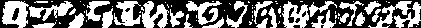

# machine-learning-cs-391l
Archival Python code from CS 391L: Machine Learning at the University of Texas at Austin with Dr. Dana Ballard.

I originally took this course in early 2020 and reorganized/published my code with some minor edits in early 2022. The course is a broad overview of supervised, unsupervised, and reinforcement learning, along with supporting methods and algorithms.

# Organization
```
/machine-learning-cs-391l       Top-level directory of the repository

|--- README.md                  This document; explains overall repository structure.
|--- requirements.txt           Contains Python package requirements

|--- data/                      Directory containing data used in the assignments.
|--- └── digits.mat             MNIST handwritten digits dataset

|--- a1-eigendigits/            Directory containing scripts and report for the Eigendigits assignment
|--- └──    eigendigits.pdf     Project report which explains the algorithm step-by-step.
|--- └──    eigendigits.py      Script to train and evaluate the classifier; saves images into /images
|--- └──    eigendigits.ipynb   Notebook which combines the report and python script into one. Functionally the same as the .py script.

|--- └──    images/             Saved images
|---        └──eigen_k##T##m####.PNG        Eigendigits for k neighbors, T Eigenvectors, and m training data points    
|---        └──recons_k##T##m####.PNG       Reconstructed digits for k neighbors, T Eigenvectors, and m training data points  
|---        └──k##.PNG                      k-Nearest Neighbor classifier accuracy for k neighbors
```

# Assignment descriptions & usage
## Installing requirements
Before running the scripts, install the Python package requirements using `pip`. At a terminal in the root directory:
```
pip3 install -r requirements.txt
```

## Assignment 1: Eigendigits
Supervised learning: Classification of handwritten MNIST digit dataset. Uses Eigenvalue decomposition to find "Eigendigits", principal components of the digits. Projects each digit into Eigenvector space, then classifies them using a k-Nearest Neighbor classifier.

The script begins by learning the principal components--the _Eigendigits_--of the handwritten MNIST digits. These are incrementally saved in the `/images` folder and look like this:



The naming convention is `images/eigen_k10T15m10000.PNG` and corresponds to $k=10$ neighbors, $T=15$ Eigenvectors, and $m=10000$ training data points. 

As a sanity check, I then reconstructed a few digits using the learned Eigendigits. The reconstructed digits look like this and are saved as `images/recons_k10T15m10000.PNG` using the same naming convention as above:


Finally, I evaluate the accuracy of the k-Nearest Neighbor classifier for different combinations of neighbors $k$, Eigenvalues $T$, and number of training points $m$. The $k=10$ classifier accuracy plot is shown below.


### Usage
Eigendigits can be run as a script or notebook; both contain identical code. To run as a script, at a console:
```
python3 a1-eigendigits/eigendigits.py
```

Alternatively, you can run `Jupyter` or `Colab` and open `a1-eigendigits/eigendigits.ipynb`. The verbage of the report `eigendigits.pdf` is also contained in the notebook for context.

## Assignment 2: Independent Component Analysis / Blind Audio Source Separation
In this assignment, a mixture of 5 audio signals is separated into its independent component signals. Beginning with a matrix $X$ that contains the mixed signals, this script finds an unmixing matrix $W$ that approximates the independent signals as $Y=WX$.

Unlike real life, the 5 independent audio channels, $U_0$,...,$U_4$, are known beforehand. (This helps with validating our method.) To generate $X$, the script creates a mixing matrix $A$ with randomized weights, and then mixes the signals together to create the mixture matrix $X=AU$. 

The unmixing matrix $W$ is found through maximum likelihood gradient descent, and estimates of the independent signals $Y$ are computed. Since the true source signals $U$ and mixing matrix $A$ are known, the correlation between the true sources $U$ and recovered sources $Y$ is then computed.

Note that the unmixing matrix $W$ should be the inverse of the mixing matrix $A$ and $AW\approx 1$

Outputs of the function include:
- True (input) source signals, e.g. `/sounds/U_0.wav'
- Recovered source signals after 100000 iterations of the gradient descent algorithm: /sounds/Y_#_100000.wav
- A plot of original source signals with mixtures: /images/originals.PNG
- Plots of the recovered signal waveforms after 1000,3000,5000,...,100000 iterations: /images/recovered_100000_iterations.PNG
- A plot of the original vs. recovered signal correlation over multiple iterations of the gradient descent algorithm:/images/correlation.PNG (see below)


Distinct signals like Homer Simpson's voice or laughter are easier to separate (source and recovered signal correlation is higher). Noisy signals like applause, vacuum, or crackling are more difficult to separate and have lower correlations with the actual signal since noise contains a lot of mutual information.

A discussion of the results is given in `ica.pdf`, and includes the correlation matrix of source/recovered signals.


### Usage
As with Assignment 1, ICA blind source separation can be run as a script or notebook; both contain identical code. To run as a script, at a console:
```
python3 a2-indep-comp-analysis/ica.py
```

Alternatively, you can run `Jupyter` or `Colab` and open `a2-indep-comp-analysis/ica.ipynb`. The verbage of the report `ica.pdf` is also contained in the notebook for context.

## Assignment 3: Problem set
Assignment 3 was a problem set with no Python component. I've included the .PDF as a placeholder to keep the directory structure consistent.

## Assignment 4: Gaussian Processes [TODO]

## Assignment 5: Backpropagation [TODO]

## Assignment 6: Reinforcement Learning [TODO]

# Known errors/desired fixes
Below is a list of potential improvements or fixes for the scripts and known issues.

## Eigendigits:
- Allow for checkpointing of the classifier to save and reuse
- Optionally disable visualization/image generation of the Eigendigits
- Check for `/image` directory and create it if not available

## Independent component analysis
- Set up matrices and signals as Torch tensors and enable GPU computing for gradient descent to reduce processing time
